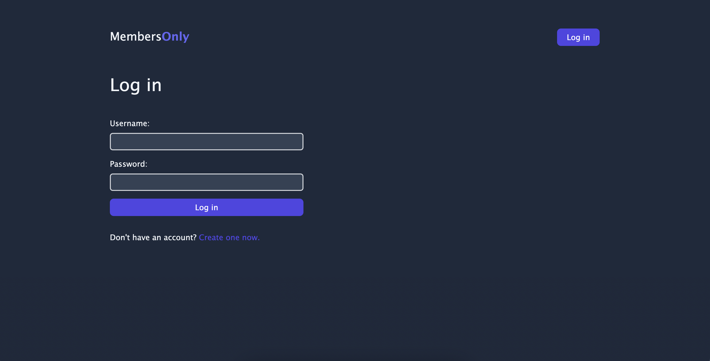
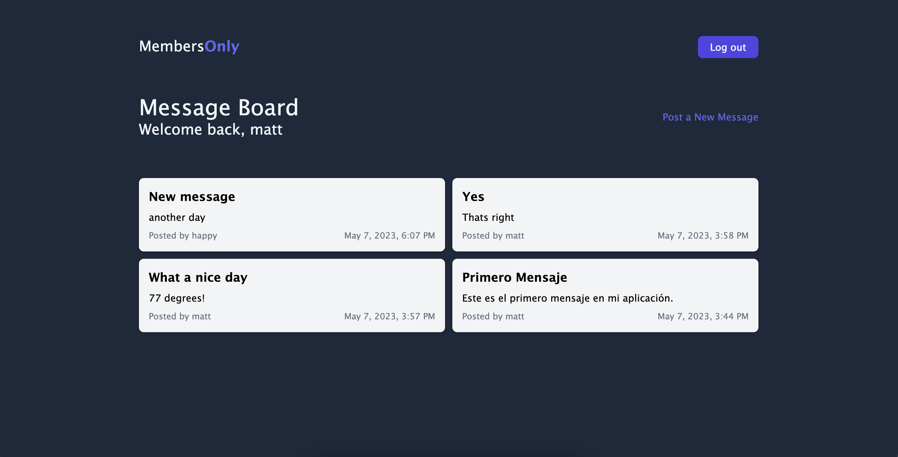
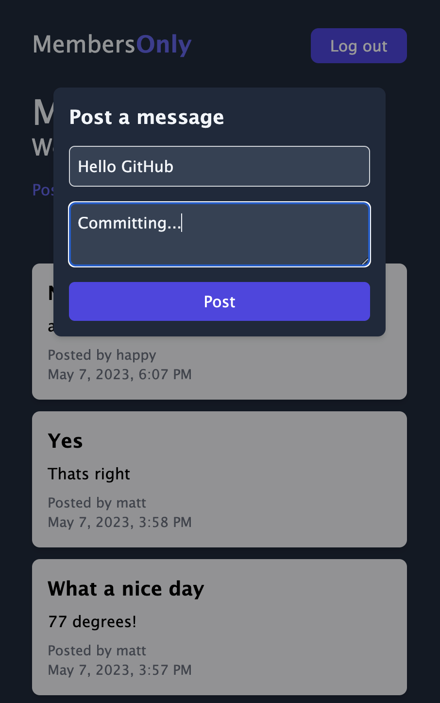

# Members Only

## Table of Contents

- [Description](#description)
- [How to use](#how-to-use)
- [Features](#features)
- [Technologies](#technologies)
- [Lessons Learned](#lessons-learned)
- [Images](#images)
- [License](#license)

## Description

This is a project for the Odin Project's NodeJS curriculum. The goal is to create a simple app that allows users to create posts and comment on them. Users can only see the author of a post if they are logged in.

## How to use

1. Clone the repository
2. Run `npm install`
3. Run `npm run dev` to start the server and client
4. Navigate to `localhost:3000` in your browser

## Features

- Login and signup with JWT authentication
- Create posts
- View posts
- Only logged in users can see the author of a post

## Technologies

- NodeJS
- Express
- MongoDB
- Mongoose
- React
- React Router
- Axios
- TailwindCSS

## Lessons Learned

- How to tie in a React frontend with a NodeJS backend using Axios and Express
- How to use JWT authentication and BCrypt to create a secure login system
- How to use Axios
- Dark Theme with TailwindCSS
- MERN stack

## Images

## License

[MIT](https://choosealicense.com/licenses/mit/)